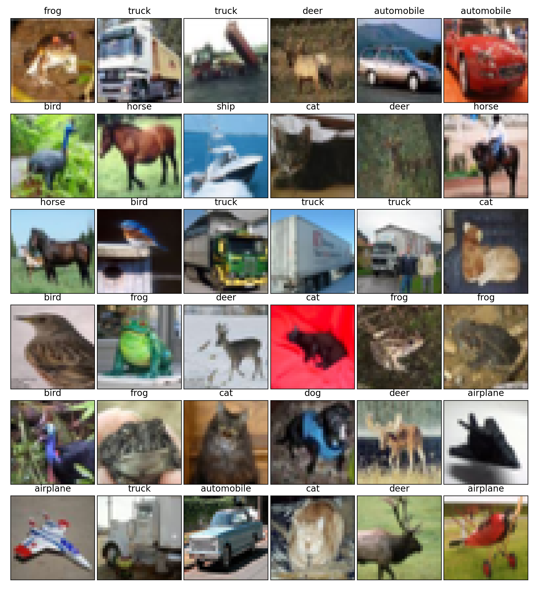

# CIFAR-10-Object Recognition in Images

* Question: Identify the subject of 60,000 labeled images?

<!---  --->
<!---   --->

CIFAR-10  is an established computer-vision dataset used for object recognition. It is a subset of the 80 million tiny images dataset and consists of 60,000 32x32 color images containing one of 10 object classes, with 6000 images per class. It was collected by Alex Krizhevsky, Vinod Nair, and Geoffrey Hinton.
